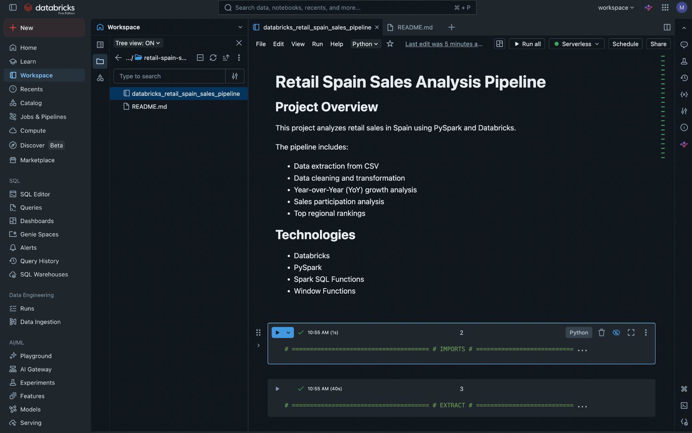
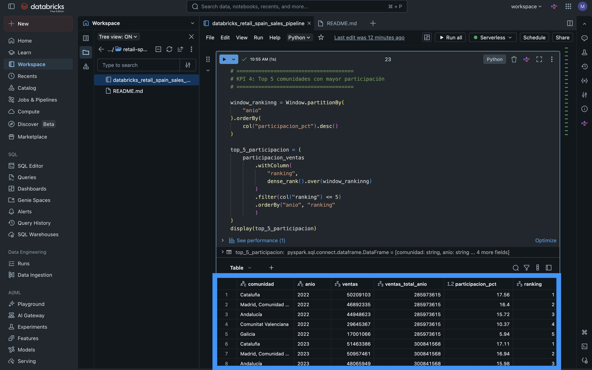

# 🇪🇸 Versión en Español

# Pipeline de Análisis de Ventas Retail en España

## Descripción General del Proyecto

Este proyecto analiza las ventas retail en España utilizando **PySpark** y **Databricks**.

El objetivo de este proyecto es construir un pipeline de datos simple para limpiar, transformar y analizar datos de ventas retail de las comunidades autónomas de España entre **2022 y 2024**.

El análisis incluye limpieza de datos, manejo de valores faltantes, conversión de tipos de datos y la creación de KPIs de negocio para comprender mejor el desempeño regional de las ventas retail.

---

## Objetivos

* Extraer datos de ventas retail desde un archivo CSV
* Limpiar y transformar datos crudos utilizando PySpark
* Manejar valores faltantes e inconsistencias en tipos de datos
* Generar KPIs de negocio
* Analizar tendencias regionales de ventas en España

---

## Dataset

**Fuente:** Dataset de ventas retail de España (INE - Instituto Nacional de Estadística)

**Período analizado:** 2022–2024

El dataset incluye información de ventas retail entre las comunidades autónomas de España.

---

## Tecnologías Utilizadas

* Databricks
* PySpark
* Funciones SQL de Spark
* Window Functions
* Python

---

## Etapas del Pipeline

El proyecto sigue una estructura simple de pipeline de datos:

### 1. Extracción (Extract)

* Se cargaron datos de ventas retail desde un archivo CSV en Databricks utilizando PySpark.

### 2. Limpieza de Datos (Data Cleaning)

* Renombrado de columnas
* Conversión de tipos de datos
* Eliminación de inconsistencias de formato
* Manejo de valores faltantes

### 3. Validación de Datos (Data Validation)

* Validación de valores nulos
* Verificación de comunidades autónomas únicas
* Validación del esquema y tipos de datos

### 4. Generación de KPIs

Se desarrollaron KPIs de negocio para analizar el desempeño de las ventas retail entre las comunidades autónomas de España.

---

## KPIs

Se desarrollaron los siguientes KPIs:

### KPI 1: Ventas Retail por Comunidad y Año

Mide las ventas retail totales por comunidad autónoma entre 2022 y 2024.

### KPI 2: Crecimiento Año contra Año (YoY)

Mide el porcentaje de crecimiento anual de ventas comparado con el año anterior.

### KPI 3: Participación de Ventas (%)

Mide la contribución de cada comunidad autónoma al total de ventas retail de España.

### KPI 4: Top 5 Comunidades por Participación de Ventas

Clasifica las comunidades con mayor participación en ventas para cada año.

### KPI 5: Comunidad con Mayor Crecimiento YoY

Identifica la comunidad autónoma con la tasa de crecimiento anual más fuerte.

---

## Insights Clave

* Cataluña, Madrid y Andalucía representaron consistentemente la mayor participación de ventas retail entre 2022 y 2024.
* Canarias ingresó al Top 5 de comunidades con mayor participación de ventas en 2024.
* Algunas comunidades más pequeñas mostraron crecimientos Year-over-Year más altos a pesar de tener menores ventas totales.

---

## Mejoras Futuras

* Incorporar más años históricos para mejorar el análisis de tendencias
* Integrar datasets adicionales como inflación (IPC) y población
* Automatizar la ejecución del pipeline
* Incorporar almacenamiento tipo Data Lake para escalabilidad futura

## Vista Previa del Proyecto 

### Vista General del Pipeline en Databricks 

 

### Ejemplo de KPI – Top 5 de Participación de Ventas 

------

# 🇺🇸 English Version

# Retail Spain Sales Analysis Pipeline

## Project Overview

This project analyzes retail sales in Spain using **PySpark** and **Databricks**.

The objective of this project is to build a simple data pipeline to clean, transform, and analyze retail sales data from Spanish autonomous communities between **2022 and 2024**.

The analysis includes data cleaning, handling missing values, data type conversion, and the creation of business KPIs to better understand regional retail sales performance.

---

## Objectives

* Extract retail sales data from a CSV file
* Clean and transform raw data using PySpark
* Handle missing values and data type inconsistencies
* Generate business KPIs
* Analyze regional sales trends in Spain

---

## Dataset

**Source:** Spanish retail sales dataset (INE - Instituto Nacional de Estadística)

**Period analyzed:** 2022–2024

The dataset includes retail sales information across Spanish autonomous communities.

---

## Technologies Used

* Databricks
* PySpark
* Spark SQL Functions
* Window Functions
* Python

---
## Pipeline Stages

The project follows a simple data pipeline structure:

### 1. Extract

* Loaded retail sales data from a CSV file into Databricks using PySpark.

### 2. Data Cleaning

* Renamed columns
* Converted data types
* Removed formatting inconsistencies
* Handled missing values

### 3. Data Validation

* Validated null values
* Checked distinct regions
* Verified schema and data types

### 4. KPI Generation

Created business KPIs to analyze retail sales performance across Spanish autonomous communities.

---

## KPIs

The following KPIs were developed:

### KPI 1: Retail Sales by Community and Year

Measures total retail sales by autonomous community between 2022 and 2024.

### KPI 2: Year-over-Year Growth (YoY)

Measures annual sales growth percentage compared to the previous year.

### KPI 3: Sales Participation (%)

Measures each community’s contribution to Spain’s total retail sales.

### KPI 4: Top 5 Communities by Sales Participation

Ranks the communities with the highest sales participation for each year.

### KPI 5: Community with Highest YoY Growth

Identifies the autonomous community with the strongest annual growth rate.

## Future Improvements

- Add more historical years for better trend analysis
- Integrate additional datasets such as inflation and population
- Automate the pipeline execution

## Project Preview 

### Databricks Pipeline Overview 

 

### KPI Example – Top 5 Sales Participation 

